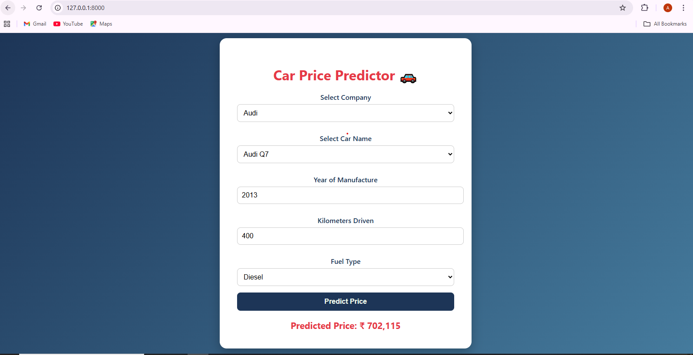

# 🚗 Car Price Predictor

A **Machine Learning Web Application** that predicts the **price of used cars** based on important features like car name, company, year, fuel type, and kilometers driven.  
This project helps users estimate the fair market value of a used car quickly and accurately.

---

## 🧠 About the Project

This project uses **Machine Learning** to understand how different factors affect the price of a car.  
The model is trained on real-world car data collected from the **Quikr Cars dataset**.  

It performs data cleaning, feature engineering, and model training using algorithms like **Linear Regression** and **XGBoost** to provide accurate price predictions.  

The web app is built with **Flask**, and has an easy-to-use interface where users can input details and get instant predictions.

---

## 🧩 Features

- Predicts car price based on user input  
- User-friendly web interface  
- Preprocessed and cleaned dataset  
- Machine Learning model trained using Python  
- Integrated with Flask backend for live predictions  

---

## 📸 Screenshot

Here’s a preview of the prediction form:



---

## 🗂️ Project Structure

car_price_predictor/
│
├── model/
│ ├── Car_Price_Predictor.ipynb # Jupyter Notebook (model training)
│ ├── quikr_car.csv # Raw dataset
│ ├── Cleaned_data.csv # Cleaned dataset
│ ├── model.joblib # Trained model file
│ ├── le.joblib # Label Encoder
│ ├── ohe.joblib # One Hot Encoder
│ └── scaler.joblib # Scaler for numerical columns
│
├── templates/
│ └── index.html # Frontend HTML form
│
├── app.py # Flask backend
├── requirements.txt # Required libraries
└── README.md # Project documentation


---

## ⚙️ Installation and Setup

1. Clone this repository:
   ```bash
   git clone https://github.com/aliahmad552/car_price_predictor.git

```
Navigate to the project directory:

cd car_price_predictor


Create and activate a virtual environment (optional but recommended):
```
python -m venv myenv
myenv\Scripts\activate


Install the required dependencies:

pip install -r requirements.txt


Run the Flask app:

python app.py


Open your browser and visit:

http://127.0.0.1:5000/

### 🧮 How It Works

The user enters car details like:

Company name

Car model

Year of purchase

Fuel type

Kilometers driven

The model processes the input data and predicts the estimated selling price of the car.

### 🧑‍💻 Technologies Used

Python

Flask

Pandas, NumPy, Scikit-learn

Joblib (for model saving/loading)

HTML, CSS (for frontend)

### 📊 Results

The trained model provides high accuracy for car price predictions and performs well on unseen data.
The web app makes it simple and interactive to get price estimates instantly.

### 📬 Contact

Author: Faheem wajid
GitHub: Faheem078

Email: Faheemtech3@gmail.com
